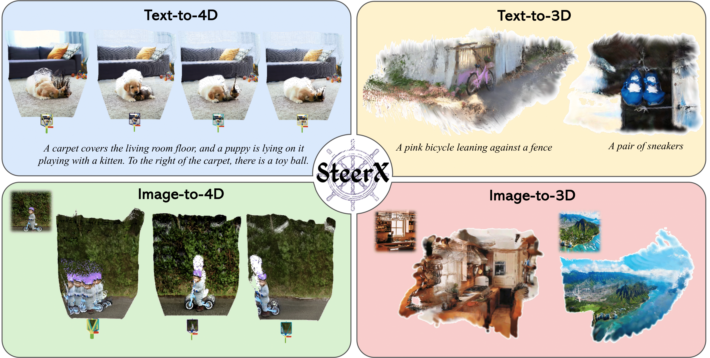

# 🛶SteerX: Creating Any Camera-Free 3D and 4D Scenes with Geometric Steering

<!-- Arxiv Link, Project Link -->

<!-- <a href="https://arxiv.org/abs/2403.09176"></a> -->
<a href="https://byeongjun-park.github.io/SteerX/"></a>

This repository contains official code implementation of "SteerX: Creating Any Camera-Free 3D and 4D Scenes with Geometric Steering". We provide Diffusers-based demo for simple testing. Please note that the results may differ from those reported in the paper.



## Todo
- [x] Project Pages
- [ ] Paper link and Bib

## Setup
1. Conda setup - CUDA 12.1 with A100 80GB GPU
   ```bash
   conda create -n steerx python=3.10 -y
   conda activate steerx
   pip install torch==2.4.1 torchvision==0.19.1 torchaudio==2.4.1 --index-url https://download.pytorch.org/whl/cu121
   pip install --extra-index-url https://miropsota.github.io/torch_packages_builder pytorch3d==0.7.8+pt2.4.1cu121
   pip install -r requirements.txt
   ```

2. Download checkpoints - we collect all checkpoints.
```bash
gdown --folder https://drive.google.com/drive/folders/1YrsZq54YMXKtNLwxqOC7yAx_nYlyymPo?usp=drive_link
```

3. (Optional for faster runtime) Compile the cuda kernels for RoPE.
```bash
cd steerx_diffusers/geometry_steering/croco/models/curope/
python setup.py build_ext --inplace
cd ../../../../../
```

4. Requirements for num_frames and resolution. As default, we set num_frames = 49 for 4D Generation.

- Mochi : 6k + 1, min(H, W) = 480
- Hunyuan : 4k + 1, min(H, W) = 480
- CogVideoX : 16k + 1, min(H, W) = 768
- DimensionX: 49, 720 x 480
- SplatFlow: 8, 256 x 256

## Run code (`--img_path` is required for image-to-3D/4D)

```bash
python eval_steerx.py --model {generative model name} --num_particles {num_particles}
python demo_steerx.py --model {generative model name} --num_particles {num_particles} --prompt {your_prompt} --img_path {img_path}
```

## Visualization

### 3D Gaussian Splatting.
Refer to [superspl.at/editor](https://superspl.at/editor)

### 4D Pointmaps. You may adjust vis setup for better results.
```bash
python viser/visualizer_monst3r.py --data {your data path}
```

## Acknowledgments
We thanks for wonderful works to build this repo. 
- Video generative models in [Mochi](https://github.com/genmoai/mochi), [HunyuanVideo](https://github.com/Tencent/HunyuanVideo), [CogVideoX](https://github.com/THUDM/CogVideo), [DimensionX](https://github.com/wenqsun/DimensionX), and [SplatFlow](https://github.com/gohyojun15/SplatFlow)
- Scene reconstruction models in [MV-DUSt3R+](https://github.com/facebookresearch/mvdust3r), [MonST3R](https://github.com/Junyi42/monst3r), and [SplatFlow](https://github.com/gohyojun15/SplatFlow). 
- Reward functions are based on [MEt3R](https://github.com/mohammadasim98/met3r)
- Steering is based on [FKS](https://github.com/zacharyhorvitz/Fk-Diffusion-Steering).

## Citation
If you find this repository helpful for your project, please consider citing our work. :)
```